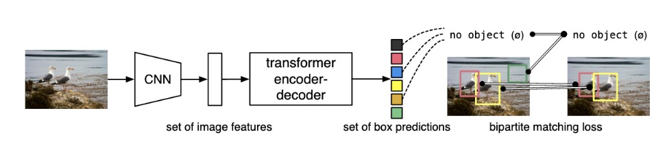
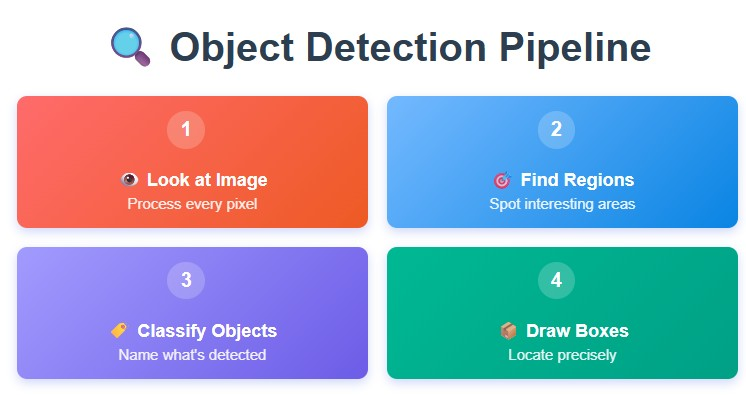
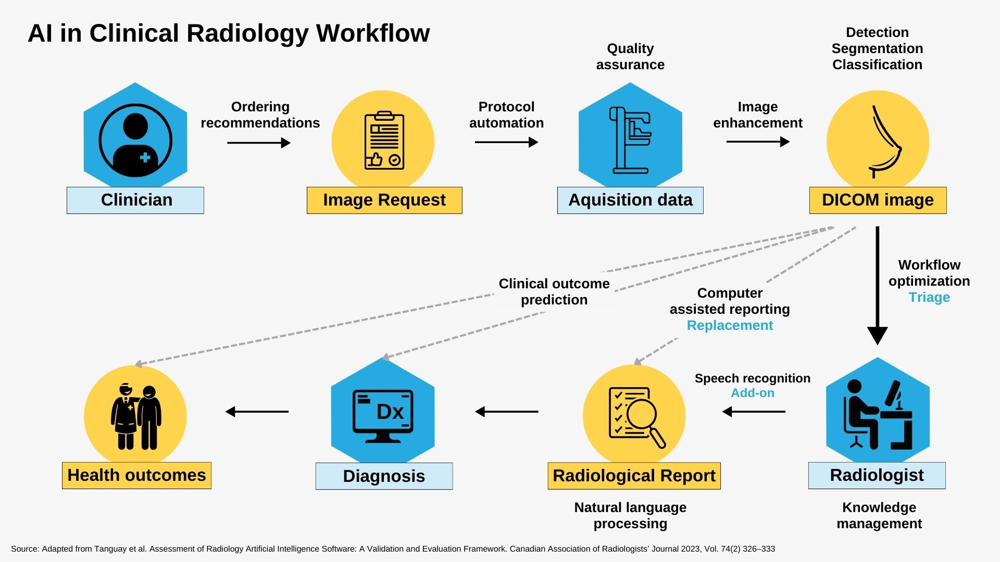

# 🩺 AI-Powered Ultrasound Image Analysis

<div align="center">
  
  
  
  
  
</div>

<br>

An end-to-end machine learning project for automatically detecting and localizing fetal anatomical structures in ultrasound images using state-of-the-art computer vision models.

> 📚 **Note**: This project is based on a DataCamp code-along tutorial for learning AI-powered medical image analysis. It serves as an educational implementation demonstrating real-world applications of computer vision in healthcare.

## 📋 Description

This project implements an AI-powered solution for ultrasound image analysis, specifically focused on detecting key fetal anatomical structures during prenatal examinations. Using Facebook's DETR (Detection Transformer) model from Hugging Face, the system can automatically identify and localize critical fetal structures including:

- 🤱 **Abdomen**: Fetal abdominal circumference for growth assessment
- 🧠 **Brain**: Fetal head circumference for gestational age estimation
- 🦴 **Femur**: Femur length measurements for skeletal development
- 🫁 **Thorax**: Chest circumference for cardiovascular assessment

### ✨ Key Features

- 🎯 **Automated Detection**: Automatically identifies fetal anatomical structures in ultrasound images
- ⚡ **Real-time Analysis**: Fast inference using pre-trained transformer models
- 🏥 **Clinical Relevance**: Focuses on medically important structures for prenatal care
- 🌍 **Low-Resource Friendly**: Designed to assist healthcare providers in resource-limited settings
- 📖 **Educational**: Complete tutorial implementation with visualization tools
- 🎓 **DataCamp-based**: Following structured learning path from DataCamp's AI curriculum

### 🔬 Technical Approach

The project leverages the DETR (Detection Transformer) architecture, which uses:
- 🤖 **Transformer-based object detection**: End-to-end detection without traditional anchor boxes
- 📚 **Transfer learning**: Fine-tuning pre-trained models on ultrasound-specific data
- 📐 **Bounding box regression**: Precise localization of anatomical structures
- 🏷️ **Multi-class classification**: Simultaneous detection of multiple structure types

<div align="center">
  
  <p><em>DETR (Detection Transformer) Architecture Overview</em></p>
</div>

#### 🎯 Object Detection Pipeline

<div align="center">
  
  <p><em>Complete Object Detection Pipeline for Medical Imaging</em></p>
</div>

### 🏥 Medical Context

Fetal ultrasound is the gold standard for monitoring fetal development and ensuring timely clinical interventions in antenatal care. This AI system can assist healthcare providers by:
- ⏱️ Reducing examination time
- 📏 Providing consistent measurements
- 👨‍⚕️ Supporting less experienced operators
- 🌱 Enabling quality care in low-resource settings

<div align="center">
  
  <p><em>AI Integration in Medical Imaging Workflow</em></p>
</div>

## 🚀 Setup Instructions

### 📋 Prerequisites

- 🐍 Python 3.8 or higher
- 🎮 CUDA-compatible GPU (recommended for training)
- 🧠 Basic understanding of machine learning and computer vision concepts

### 💻 Installation

1. **📥 Clone the repository:**
   ```bash
   git clone https://github.com/Polqt/AI-Powered-Ultrasound-Image-Analysis.git
   cd AI-Powered-Ultrasound-Image-Analysis
   ```

2. **🏠 Create and activate a virtual environment:**
   ```bash
   python -m venv ultrasound_env
   source ultrasound_env/bin/activate  # On Windows: ultrasound_env\Scripts\activate
   ```

3. **📦 Install required packages:**
   ```bash
   pip install torch torchvision
   pip install transformers datasets
   pip install pillow matplotlib
   pip install numpy pandas
   pip install jupyter
   ```

4. **📊 Download the dataset:**
   The dataset contains ultrasound images and corresponding annotations. Download from the provided Google Drive link in the notebook or prepare your own dataset following the same structure:
   ```
   dataset/
   ├── train_dataset/
   │   ├── *.png (ultrasound images)
   │   └── train_annotations.json
   └── test_dataset/
       ├── *.png (ultrasound images)
       └── test_annotations.json
   ```

### 📁 Dataset Structure

Each annotation file contains JSON objects with:
- 🏷️ `label`: Structure type (abdomen, brain, femur, thorax)
- 📐 `bbox`: Bounding box coordinates [x_min, y_min, x_max, y_max]
- 🖼️ `image_filename`: Corresponding image file

## 💡 Usage

### 📓 Running the Notebook

1. **🚀 Start Jupyter Notebook:**
   ```bash
   jupyter notebook
   ```

2. **📖 Open `notebook.ipynb`** and follow the step-by-step tutorial

### 🔄 Key Workflow Steps

1. **📊 Data Loading and Preprocessing:**
   - Load ultrasound images and annotations
   - Transform data for DETR model input
   - Visualize dataset samples

2. **🤖 Model Setup:**
   - Load pre-trained DETR model from Hugging Face
   - Configure for ultrasound-specific classes
   - Set up image processor

3. **🎯 Training:**
   - Fine-tune the model on ultrasound data
   - Monitor training progress
   - Save checkpoints

4. **📈 Evaluation:**
   - Test model performance on validation set
   - Visualize predictions vs ground truth
   - Calculate precision metrics

5. **🔍 Inference:**
   - Load trained model
   - Process new ultrasound images
   - Visualize detection results

### 💻 Example Usage

```python
# Load trained model
from transformers import DetrForObjectDetection, DetrImageProcessor

model = DetrForObjectDetection.from_pretrained("detr-ultrasound/checkpoint-25")
processor = DetrImageProcessor.from_pretrained("detr-ultrasound/checkpoint-25")

# Process image
image = Image.open("path/to/ultrasound.png")
inputs = processor(images=image, return_tensors="pt")
outputs = model(**inputs)

# Post-process results
target_sizes = torch.tensor([image.size[::-1]])
results = processor.post_process_object_detection(outputs, target_sizes=target_sizes, threshold=0.5)
```

### 📊 Sample Results

<div align="center">
  <table>
    <tr>
      <td align="center">
        
        <br><em>Input Ultrasound Image</em>
      </td>
      <td align="center">
        
        <br><em>AI Detection Results</em>
      </td>
    </tr>
  </table>
  <p><em>Example of fetal structure detection in ultrasound images</em></p>
</div>

## 📂 Project Structure

```
🏗️ AI-Powered-Ultrasound-Image-Analysis/
├── 📓 notebook.ipynb                 # Main tutorial notebook
├── 📊 dataset/                      # Ultrasound image dataset
│   ├── 🎯 train_dataset/           # Training images and annotations
│   └── 🧪 test_dataset/            # Test images and annotations
├── 🤖 detr-ultrasound/             # Model checkpoints (created during training)
├── 🖼️ figures/                     # Documentation images
│   ├── AI_in_radiology_workflow.jpg
│   ├── DETR-architecture.jpg
│   └── object-detection-pipeline.jpg
└── 📄 README.md                    # This file
```

## 🤝 Contributor Guidelines

We welcome contributions to improve this project! Please follow these guidelines:

### 🌟 Getting Started

1. **🍴 Fork the repository** and create a new branch for your feature
2. **⚙️ Set up the development environment** following the setup instructions
3. **📖 Read the code** and understand the project structure

### 🔄 Contributing Process

1. **🐛 Create an Issue:**
   - Describe the bug, feature request, or improvement
   - Include relevant details and context
   - Wait for discussion before starting work

2. **💻 Development:**
   - Follow Python PEP 8 style guidelines
   - Add comments and docstrings for new functions
   - Ensure code is well-documented and readable

3. **🧪 Testing:**
   - Test your changes with the provided dataset
   - Verify that existing functionality still works
   - Include example outputs if applicable

4. **📝 Documentation:**
   - Update README.md if needed
   - Add inline documentation for new features
   - Update notebook cells with clear explanations

### Code Standards

- **Python Style**: Follow PEP 8 conventions
- **Jupyter Notebooks**: 
  - Clear cell outputs and explanations
  - Remove large outputs before committing
  - Include markdown cells explaining each step
- **Comments**: Write clear, concise comments explaining complex logic
- **Variable Names**: Use descriptive variable names

### ⚡ Types of Contributions

We welcome the following types of contributions:

1. **🐛 Bug Fixes:**
   - Fix issues with model training or inference
   - Correct data loading problems
   - Address visualization bugs

2. **✨ Feature Enhancements:**
   - Add new evaluation metrics
   - Implement additional visualization tools
   - Support for new ultrasound structure types

3. **📚 Documentation:**
   - Improve README clarity
   - Add more detailed code comments
   - Create additional tutorial content

4. **🚀 Performance Improvements:**
   - Optimize training speed
   - Reduce memory usage
   - Improve inference efficiency

5. **📊 Dataset Improvements:**
   - Add more diverse ultrasound images
   - Improve annotation quality
   - Create data augmentation techniques

### 📤 Submission Process

1. **🔀 Pull Request:**
   - Create a descriptive pull request title
   - Provide detailed description of changes
   - Reference any related issues

2. **👀 Review Process:**
   - Respond to reviewer feedback promptly
   - Make requested changes
   - Ensure all checks pass

3. **🎉 Merge:**
   - Pull requests will be merged after approval
   - Contributors will be acknowledged

### 💬 Communication

- **❓ Questions**: Open an issue for project-related questions
- **💭 Discussions**: Use GitHub Discussions for broader topics
- **🐞 Bug Reports**: Include system info, error messages, and reproduction steps

### 📜 Code of Conduct

- 🤝 Be respectful and professional in all interactions
- 💡 Focus on constructive feedback
- 🌈 Help create an inclusive environment for all contributors
- 📋 Follow GitHub's community guidelines

🙏 Thank you for contributing to AI-Powered Ultrasound Image Analysis! Your contributions help improve healthcare accessibility through AI technology.

## 🎓 Acknowledgments

This project is based on educational content from **🎓 DataCamp**, specifically their AI and machine learning curriculum focusing on computer vision applications in healthcare. The implementation follows their structured approach to teaching real-world AI applications in medical imaging.

**📚 DataCamp Course Reference**: AI-Powered Medical Image Analysis
- 📖 Original tutorial content and structure provided by DataCamp
- 🔄 Adapted and extended for educational purposes
- 🎯 Focus on practical implementation of DETR models for ultrasound analysis

---

<div align="center">

**🩺 Empowering Healthcare Through AI** 

*Made with ❤️ for better medical outcomes*

<br>

### 🌟 Key Technologies Used

<div style="display: flex; justify-content: center; flex-wrap: wrap; gap: 10px;">
  
  
  
  
  
</div>

<br>


</div>
